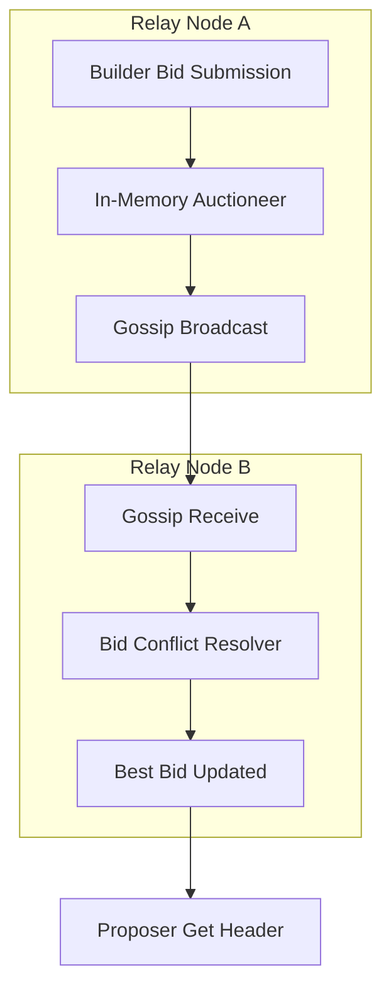

# Gossip-Synced In-Memory Auctioneer for MEV-Boost Relays

This project implements a high-performance, Rust-based in-memory Auctioneer designed to replace Redis in the critical `get_header` path of PBS relays like [Titan's Helix](https://github.com/gattaca-com/helix). It synchronizes bids across geo-distributed nodes using a CRDT-based gossip protocol, aiming to reduce latency, eliminate centralized coordination, and improve proposer and builder outcomes.

## 🚀 TL;DR
Gossip-Synced In-Memory Auctioneer

🦀 Rust-based replacement for Redis in Helix-style MEV-Boost relays
📡 CRDT + UDP gossip for bid propagation
⚡ Cuts get_header latency by 30–50%
🔐 Attestation-ready (TEE support planned)


## ✨ Goals

* Cut latency in the bid path by 30–50%
* Eliminate Redis dependency in the hot path
* Enable decentralized, fault-tolerant bid propagation
* Maintain convergence guarantees via gossip
* Align with SUAVE and enshrined PBS design principles

## 📦 Architecture Overview



## 🧠 Design Highlights

* **Bid CRDT Structure** with merge logic:

  ```rust
  struct Bid {
      value: U256,
      timestamp: u64, // monotonic clock
      builder_id: String,
      nonce: u32, // anti-replay
      signature: [u8; 64], // attestation-ready
  }
  ```
* **UDP-based gossip** with configurable fanout (e.g., 3 peers)
* **Attestation scaffolding** for future TEE integration
* **Latency benchmarking tools**

## TEE integration plan
- Builder-side TEE: Ensures bundle execution / ordering is trusted
- Relay-side TEE: Ensures best bid selection is tamper-proof and fast
- Optional Proposer TEE: May be used to verify attestations or simulate payloads privately in the future

```d2
direction: right

Validator: Proposer (Validator)
Builder: Builder Node
Relay: Helix Relay
TEE1: TEE (Builder)
TEE2: TEE (Relay)
TEE3: TEE (Optional: Proposer)
Consensus: Ethereum Beacon Chain

Proposer -> Relay: "get_header"
Builder -> TEE1: "Build block"
TEE1 -> Relay: "Submit attested bid"
Relay -> TEE2: "Select best bid"
TEE2 -> Proposer: "Return signed header"
Proposer -> Relay: "get_payload"

TEE1: style.fill = "#eef", style.stroke = "#00f"
TEE2: style.fill = "#eef", style.stroke = "#00f"
TEE3: style.fill = "#ddd", style.dashed = true
```

## 📁 Structure

```
inmemory-auctioneer/
├── Cargo.toml
├── README.md
├── docs/
│   └── FRP.md          # Full research proposal
├── src/
│   ├── main.rs         # Entry point and example
│   ├── auctioneer.rs   # Core in-memory logic
│   ├── gossip.rs       # Gossip layer for syncing
│   ├── bid.rs          # Bid struct and merge logic
│   └── config.rs       # Runtime parameters
└── benchmarks/
    └── gossip_latency.rs
```

## 🧪 Initial Targets (Week 1–2)

* ✅ Bid struct + merge logic
* 🔲 UDP gossip skeleton
* 🔲 Multi-node local simulation
* 🔲 95% convergence in <100ms (local test)

## 🗺️ Future Extensions

* Remote attestation (Intel TDX or Fortanix SGX)
* Optional fallback to disk cache
* Peer scoring for bid trustworthiness

## 🤝 Collaboration

Inspired by Titan Builder, Flashbots, and Rorqual. Meant to plug directly into Helix or similar relays.

Contact: **Stephan Thomas** – [stovole@gmail.com](mailto:stovole@gmail.com)
