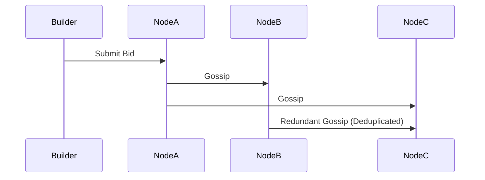

# FRP: Gossip-Synced In-Memory Auctioneer for Distributed PBS Relays  

**Status**: DRAFT  
**Project Lead**: Stephan Thomas ([stovole@gmail.com](mailto:stovole@gmail.com))  
**Requested Funding**: $15,000 USD (1 month)  

---

## Description  

MEV-Boost relays suffer from Redis-induced latency in bid synchronization, costing proposers revenue and disadvantaging builders. This project replaces Redis with a low-latency gossip protocol to decentralize and accelerate bid propagation.  

We propose a Rust-based, in-memory Auctioneer module for MEV-Boost relays (e.g., Titan's Helix) that synchronizes best block bids across geo-distributed nodes using a CRDT-based gossip protocol. The solution eliminates Redis from the critical `get_header` path while maintaining eventual consistency, improving builder fairness and proposer revenue in high-load slots.  

---

## Problem Statement  

MEV-Boost relays like Titan's Helix rely on Redis to synchronize bids across global nodes, introducing 50-100ms latency in the `get_header` flow (per Titan's measurements). This bottleneck:  

- Reduces proposer revenue due to delayed block delivery  
- Disadvantages builders with higher-latency connections  
- Creates a centralized point of failure conflicting with PBS decentralization goals  

---

## Proposed Solution  

A **Rust-based in-memory Auctioneer** implementing:  

- **UDP-based CRDT gossip**: Low-latency eventual consistency  
- **Hybrid conflict resolution**: `max(value) → earliest timestamp → builder_id`  
- **Attestation-ready design**: Scaffolding for future TEE integration  

```plaintext
Node A (New Bid) → Multicast → Nodes B, C, D  
                     ↓  
                Nodes forward to 3 peers  
                     ↓  
            95% convergence in <100ms  
```

---

## Motivation  

Helix's Redis-based synchronization creates non-negligible latency during time-critical `get_header` responses. Our solution:  

1. **Latency reduction**: Eliminates Redis round-trips (30-50% estimated improvement)  
2. **Decentralization**: Aligns with enshrined PBS and SUAVE architectures  
3. **Reusability**: Modular crate for Flashbots/Titan compatibility  

Influenced by:  
- Titan's Helix roadmap  
- Rorqual's TEE research  
- FRP-50's latency analysis  

---

## Technical Approach  

### Core Components  

```rust
struct Bid {
    value: U256,
    timestamp: u64,  // Monotonic clock
    builder_id: String,
    nonce: u32,      // Anti-replay
    signature: [u8; 64]  // Attestation-ready
}
```

### Gossip Protocol  
- **UDP multicast** with epidemic dissemination (3 peers/node)  
- **Loss tolerance**: 50ms retransmit timeout  
- **State convergence**: Periodic checksum validation  

### Threat Model & Mitigations  
| Threat            | Mitigation                          |
|-------------------|-------------------------------------|
| Sybil attacks     | Rate-limiting (10 bids/sec/pubkey) |
| Network spoofing  | Bid nonces + signatures            |
| Late bids         | 80% slot time cutoff               |

---

## Implementation Plan (4 Weeks)  

### Week 1: Auctioneer Core  
- CRDT merge logic implementation  
- Thread-safe `Arc<RwLock<BidStore>>`  
- TEE attestation scaffolding (no-op)  

### Week 2: Gossip Protocol  
- UDP multicast with Tokio  
- 5-node Docker cluster simulation  
- Packet loss testing (10% via `tc-netem`)  

### Week 3: Benchmarking  
- **vs Redis**: `get_header` p50/p99 latency  
- Convergence time (95% node agreement)  
- Historical MEV replay (Flashbots Archive)  

### Week 4: Documentation & Release  
- Benchmark report (latency/MEV capture)  
- GitHub repo with:  
  - Threat model documentation  
  - Deployment guide  
  - Network topology examples  

---

## Impact  

| Metric               | Improvement Target |
|----------------------|--------------------|
| `get_header` latency | 30-50% reduction   |
| Proposer revenue     | 5-15% increase     |
| Builder fairness     | Geographic parity  |

**Long-term value**:  
- Foundation for trust-minimized PBS  
- SUAVE-compatible bid aggregation  
- Reduced MEV leakage  

---

## Budget Allocation  

| Category           | Amount  |
|--------------------|---------|
| Development        | $12,000 |
| Cloud Benchmarking | $2,000  |
| Documentation      | $1,000  |

---

## Prior Art & Differentiation  

| Project   | Focus              | Our Advantage               |
|-----------|--------------------|-----------------------------|
| Helix     | Redis-based        | Decentralized gossip        |
| Rorqual   | TEE-dependent      | Minimalist first approach   |
| FRP-50    | Rebate mechanisms  | Complementary latency fix   |

---

## Open Questions & Collaboration  

**Research questions**:  
1. Can lightweight attestation replace full TEEs?  
2. Do latency reductions favor large builders?  

**Collaboration opportunities**:  
- Flashbots: SUAVE alignment testing  
- Titan: Real-world deployment data  
- TEE researchers: Hybrid attestation models  

---

## Appendix  

**Example Bid Propagation**:  


**Next Steps**:  
1. Finalize protocol spec with Titan team  
2. Establish benchmarking baseline  
3. Coordinate with Flashbots research  
